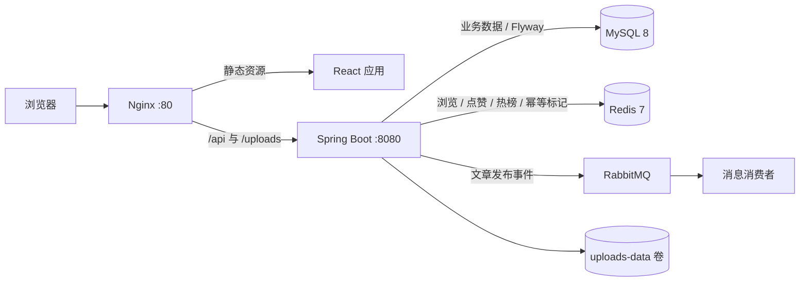

# Bit Forum

> 社区内容审核与互动治理平台

基于 Spring Boot、MyBatis-Plus、Redis 与 RabbitMQ 构建，覆盖内容发布审核、用户互动、举报治理、通知、运营看板和后台管理，并通过 React/Nginx 与 Docker Compose 提供完整的前后端运行环境。

这是一个持续迭代的个人毕业设计与 Java 后端求职项目。项目重点是呈现可追踪的业务状态流转、数据一致性处理与工程化实践，不宣称生产级流量或大型分布式系统能力。

## 核心能力

- **内容生命周期**：草稿、提交审核、审核通过/驳回、发布和下架，保留审核记录与处理原因。
- **社区互动**：评论、点赞、收藏、关注、通知、公开主页与个人内容管理。
- **内容治理**：文章/评论举报、数据库唯一约束防止并发重复举报、管理员处理与状态流转。
- **实时指标**：Redis String 记录浏览量、Set 完成点赞去重、ZSet 维护热门排行，定时同步核心指标到 MySQL。
- **后台管理**：内容审核、用户与板块管理、举报处理、数据看板和依赖健康检查。
- **工程交付**：Flyway 迁移、OpenAPI、Actuator、自动化测试、React/Nginx 镜像与五服务 Compose 编排。

## 技术栈

| 层次 | 技术 |
| --- | --- |
| 后端 | Java 17、Spring Boot 3.4.5、Spring MVC、MyBatis-Plus 3.5.9 |
| 数据 | MySQL 8、Flyway V1-V11、Redis 7 |
| 消息 | RabbitMQ 3、Publisher Confirm/Returns、手动 ACK、DLX/DLQ |
| 安全 | JWT、BCrypt、Jakarta Validation、用户/管理员拦截器 |
| 可观测与文档 | Actuator、Springdoc OpenAPI |
| 测试 | JUnit 5、Spring Boot Test、Mockito、Vitest、Testing Library |
| 前端 | React 19、Vite 7、React Router 7、Axios、Nginx |
| 部署 | Maven、Docker、Docker Compose |

## 系统架构



Compose 实际编排 `frontend`、`app`、`mysql`、`redis`、`rabbitmq` 五个服务。Nginx 托管 React 构建产物，并把 `/api` 与 `/uploads` 转发到 Spring Boot。

## 核心业务链路

### 1. 内容审核

```text
创建草稿 DRAFT
  → 提交审核 PENDING
  → 管理员审核
      ├─ 通过 → PUBLISHED → 审核记录 + 通知 + MQ 事件
      └─ 驳回 → REJECTED → 驳回原因 + 通知
  → 已发布内容可由管理员下架 OFFLINE
```

普通用户只能操作自己的草稿或被驳回文章；管理员接口会重新查询数据库中的账号状态和角色，不只信任 JWT 中的身份信息。

### 2. 举报治理

```text
用户举报文章/评论
  → 校验内容状态、作者与举报人
  → 应用层重复检查
  → 数据库生成列 + 唯一索引拦截并发重复举报
  → 管理员处理
  → RESOLVED / REJECTED
```

重复举报控制最终落在数据库唯一约束上，避免只依赖“先查询再插入”的竞态判断。

### 3. Redis 指标

```text
文章浏览 → String 计数 ┐
文章点赞 → Set 去重    ├→ ZSet 热度排行
                       └→ 定时任务读取 Redis → MySQL 持久化
```

Redis 承担实时写入与排行查询，MySQL 保存可持久化的浏览量和点赞数。当前采用定时同步实现最终一致性，不把它描述成跨 Redis/MySQL 的强事务。

### 4. RabbitMQ 事件

```text
管理员审核通过
  → RabbitTemplate 发布 ArticlePublishMessage
  → DirectExchange 路由到 article.publish.queue
  → 消费者幂等检查与业务处理
  → 成功 basicAck
  → 失败 basicNack(requeue=false) → DLX → DLQ
```

项目已实现 Confirm/Returns 回调、JSON 消息、手动 ACK/NACK、Redis 幂等标记和 DLQ 基础链路；尚未实现完整 Outbox、确认失败自动重试或自动补偿，详见 [求职展示代码审计](./docs/recruitment-audit.md)。

## 业务模块

| 模块 | 已实现能力 |
| --- | --- |
| 用户与权限 | 注册登录、BCrypt、JWT、账号状态复核、用户/管理员权限隔离 |
| 板块与内容 | 板块管理、草稿、审核状态流转、搜索、分页、封面上传 |
| 社区互动 | 评论、点赞、收藏、关注/取关、粉丝/关注列表 |
| 通知中心 | 评论、点赞、收藏、审核与下架通知，未读统计和已读操作 |
| 举报治理 | 文章/评论举报、并发重复限制、管理员处理 |
| 运营后台 | 用户、内容、板块、举报管理，统计看板与健康检查 |
| 数据与接口 | Redis 热榜与指标同步、Flyway 迁移、Swagger/OpenAPI、Actuator |

## 可在面试中展开的工程点

1. **状态机式内容审核**：用明确状态与允许的转换约束编辑、审核、发布和下架操作，并持久化审核记录。
2. **按访问模式选择 Redis 结构**：String 适合计数，Set 适合用户级去重，ZSet 适合按分数排序的热门榜。
3. **数据库约束兜底并发一致性**：收藏、关注和待处理举报均使用唯一索引；关注与举报在并发重复时会转换为业务提示。
4. **消息可靠性基础链路**：区分 Broker Confirm、路由 Returns、消费者 ACK 与死信处理，同时明确当前补偿能力的边界。
5. **后端最终鉴权与响应脱敏**：拦截器回查用户状态/角色，DTO 不返回密码字段，上传路径做规范化检查。
6. **可复现的工程交付**：Flyway 管理数据库版本，OpenAPI 提供接口文档，Compose 统一前后端和基础设施环境。

## 项目结构

```text
.
├── src/main/java/com/bitforum/       # Controller、Service、Mapper、DTO、配置与任务
├── src/main/resources/
│   ├── application.yml               # 环境变量驱动的运行配置
│   └── db/migration/                  # Flyway V1-V11
├── src/test/                          # 后端控制器、服务与集成测试
├── frontend/                          # React/Vite 前端与 Nginx 镜像
├── docs/
│   ├── graduation/                    # 毕业设计模块与过程记录
│   ├── interview/                     # 演示与面试材料
│   └── recruitment-audit.md           # 本轮只记录、未大改的代码问题
├── Dockerfile
├── docker-compose.yml
├── .env.example
└── pom.xml
```

## 快速启动

### Docker Compose

前置要求：Docker Desktop，且本机 `80`、`8080`、`3307`、`6379`、`5672`、`15672` 端口可用。

```powershell
git clone https://github.com/JJJJIU9999/Bit_Forum_Spring.git
cd Bit_Forum_Spring
Copy-Item .env.example .env
# 编辑 .env，替换数据库、RabbitMQ 与 JWT 占位值
docker compose config --quiet
docker compose up --build -d
```

启动后：

| 服务 | 地址 |
| --- | --- |
| 前端 | `http://localhost` |
| 后端 API | `http://localhost:8080` |
| Swagger UI | `http://localhost:8080/swagger-ui.html` |
| Actuator 健康检查 | `http://localhost:8080/actuator/health` |
| RabbitMQ 管理台 | `http://localhost:15672` |
| MySQL（宿主机） | `localhost:3307` |

普通停止会保留 MySQL 与上传数据卷：

```powershell
docker compose down
```

不要把 `docker compose down -v` 当作普通停止命令，它会删除数据卷。

### 本地开发与验证

本地运行后端前，需提供 `SPRING_DATASOURCE_PASSWORD`、`SPRING_RABBITMQ_PASSWORD` 和不少于 32 字节的 `JWT_SECRET`，并确保 MySQL、Redis、RabbitMQ 地址与本机环境一致。

```powershell
# 后端
mvn test
mvn spring-boot:run

# 前端
cd frontend
npm ci
npm test
npm run build
npm run dev
```

前端开发服务器默认访问 `http://localhost:5173`，Vite 将 `/api` 请求代理到 `http://localhost:8080`。

## 项目边界

- 本项目是个人毕业设计和求职作品，没有真实生产用户量、QPS 或线上可用性数据。
- `@Transactional` 只覆盖本地 MySQL 事务，不自动覆盖 RabbitMQ 与 Redis。
- MQ 当前是可靠性基础实现，不宣称 Exactly Once、绝对不丢消息或完整自动补偿。
- Redis 指标同步属于最终一致性方案；现有全量扫描、N+1 查询、幂等标记时机和测试隔离等问题已如实记录，留待后续按优先级处理。

更多演示材料见 [5 分钟项目演示稿](./docs/interview/5分钟项目演示稿.md)；当前技术债和面试追问点见 [求职展示代码审计](./docs/recruitment-audit.md)。
