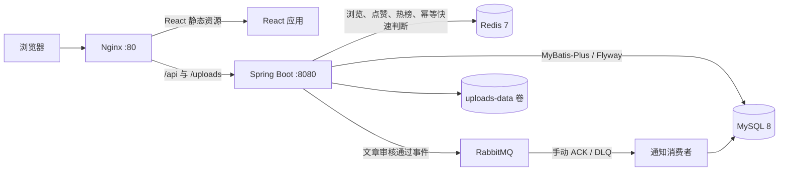

# Bit Forum

> 社区内容审核与互动治理平台

Bit Forum 是一个个人毕业设计项目。后端基于 Spring Boot、MyBatis-Plus、MySQL、Redis 与 RabbitMQ，前端基于 React/Vite，覆盖文章审核、社区互动、举报治理、通知和后台管理。

项目重点是完整实现可运行的业务链路，并对事务边界、并发唯一性、消息幂等、HTTP 语义、测试与容器编排做明确处理。本仓库不包含真实生产流量、QPS 或线上可用性数据。

## 已实现能力

- 内容生命周期：草稿、提交审核、审核通过/驳回、发布和下架，保留审核记录与处理原因。
- 社区互动：评论、点赞、收藏、关注、通知、公开主页和个人内容管理。
- 内容治理：文章/评论举报、数据库唯一约束防止并发重复提交、管理员处理与状态流转。
- Redis 指标：String 记录浏览量、Set 完成用户级点赞去重、ZSet 维护热门排行，定时同步核心指标到 MySQL。
- 后台管理：文章审核、用户/板块/举报管理、统计看板和依赖健康检查。
- 工程交付：Flyway 迁移、OpenAPI、Actuator、后端/前端自动化测试、GitHub Actions 与五服务 Docker Compose 编排。

## 技术栈

| 层次 | 技术 |
| --- | --- |
| 后端 | Java 17、Spring Boot 3.4.5、Spring MVC、MyBatis-Plus 3.5.9 |
| 数据 | MySQL 8、Flyway V1-V12、Redis 7 |
| 消息 | RabbitMQ 3、Publisher Confirm/Returns、手动 ACK/NACK、DLX/DLQ |
| 安全 | JWT、BCrypt、Jakarta Validation、用户/管理员拦截器 |
| 可观测与接口 | Actuator、Springdoc OpenAPI |
| 测试 | JUnit 5、Spring Boot Test、Mockito、Vitest、Testing Library |
| 前端 | React 19、Vite 7、React Router 7、Axios、Nginx |
| 交付 | Maven、Docker、Docker Compose、GitHub Actions |

## 系统架构



Compose 编排 `frontend`、`app`、`mysql`、`redis`、`rabbitmq` 五个服务。MySQL、Redis 和 RabbitMQ 均有健康检查，应用容器会等待三个依赖就绪后启动。

## 关键实现

### 内容审核与权限

```text
DRAFT 草稿
  → PENDING 待审核
      ├─ PUBLISHED 审核通过
      └─ REJECTED 审核驳回
  → OFFLINE 管理员下架
```

普通用户只能操作自己的内容。登录后的请求使用 Bearer JWT，用户和管理员拦截器会回查账号状态/角色，不只依赖 token 内信息。错误响应在保留统一 `Result` 结构的同时，对齐 400、401、403、404、409 和 500 的 HTTP 状态。

### RabbitMQ 审核通知

```text
管理员审核通过
  → 更新文章状态并保存审核记录
  → 发布 ArticlePublishMessage
  → 消费者创建审核通过通知
  → 成功后写入 7 天 Redis 幂等快速标记并 ACK
  → 失败 NACK(requeue=false) 进入 DLQ
```

`notification.source_message_id` 有数据库唯一约束，确保消息重放不会重复插入通知；Redis 标记是快速判断，不是唯一正确性保证。项目已实现 Confirm/Returns 回调、手动 ACK/NACK 和死信队列，但尚未实现 Outbox、发布失败自动重试或 DLQ 自动补偿。

### 并发唯一性与查询数量

- 收藏、关注和待处理举报都使用数据库唯一约束兜底；收藏竞态中的重复键会统一转换为 HTTP 409。
- 文章列表按当前页的板块 ID 和文章 ID 批量补齐板块名/收藏数，避免逐文章查询。
- 图片上传同时校验大小、扩展名、MIME 与真实内容；JPEG/PNG 使用文件头和图片解码，WebP 校验 RIFF/WEBP 容器和数据块结构。

## 项目结构

```text
.
├── .github/workflows/ci.yml        # 后端与前端 CI
├── src/main/java/com/bitforum/    # Controller、Service、Mapper、DTO、配置与任务
├── src/main/resources/
│   ├── application.yml            # 环境变量驱动的运行配置
│   └── db/migration/              # Flyway V1-V12
├── src/test/                       # 后端控制器、服务与集成测试
├── frontend/                       # React/Vite 前端与 Nginx 镜像
├── docs/
│   ├── graduation/                # 毕业设计模块与过程记录
│   └── technical-debt.md          # 当前工程边界与已处理项
├── Dockerfile
├── docker-compose.yml
├── .env.example
└── pom.xml
```

## 快速启动

前置要求：Docker Desktop，且本机 `80`、`8080`、`3307`、`6379`、`5672`、`15672` 端口可用。

```powershell
git clone https://github.com/JJJJIU9999/Bit_Forum_Spring.git
cd Bit_Forum_Spring
Copy-Item .env.example .env
# 编辑 .env，替换数据库、RabbitMQ 与 JWT 占位值
docker compose config --quiet
docker compose up --build -d
```

| 服务 | 地址 |
| --- | --- |
| 前端 | `http://localhost` |
| 后端 API | `http://localhost:8080` |
| Swagger UI | `http://localhost:8080/swagger-ui.html` |
| Actuator | `http://localhost:8080/actuator/health` |
| RabbitMQ 管理台 | `http://localhost:15672` |
| MySQL（宿主机） | `localhost:3307` |

```powershell
# 停止服务，保留 MySQL 和上传数据卷
docker compose down
```

`docker compose down -v` 会删除数据卷，不应作为普通停止命令。

## 本地测试与开发

后端大部分 Spring 集成测试会连接 MySQL、Redis 和 RabbitMQ。可先启动三个依赖服务，再将测试进程的环境变量设为与 `.env` 一致：

```powershell
docker compose up -d mysql redis rabbitmq

$env:SPRING_DATASOURCE_URL='jdbc:mysql://localhost:3307/bit_forum?useSSL=false&allowPublicKeyRetrieval=true&serverTimezone=Asia/Shanghai&characterEncoding=UTF-8'
$env:SPRING_DATASOURCE_USERNAME='root'
$env:SPRING_DATASOURCE_PASSWORD='<与 MYSQL_ROOT_PASSWORD 一致>'
$env:SPRING_RABBITMQ_USERNAME='<与 .env 一致>'
$env:SPRING_RABBITMQ_PASSWORD='<与 .env 一致>'
$env:JWT_SECRET='<不少于 32 字节的本地测试密钥>'
mvn test
mvn spring-boot:run
```

前端验证：

```powershell
cd frontend
npm ci
npm test
npm run build
npm run dev
```

GitHub Actions 使用独立的 MySQL、Redis 和 RabbitMQ service containers 运行后端测试，并在独立 job 中运行前端测试与构建。

## 工程边界

- `@Transactional` 只覆盖本地 MySQL 事务，不自动覆盖 RabbitMQ 与 Redis。
- MQ 是可测试的基础可靠链路，不宣称 Exactly Once、绝对不丢消息或完整自动补偿。
- Redis 指标与 MySQL 之间是定时同步的最终一致性，当前仍是全量扫描已发布文章。
- 后端测试在本地依赖三个基础服务；CI 通过 service containers 提供可复现环境。

更完整的开放问题和本轮已处理项见 [工程技术债](./docs/technical-debt.md)。
