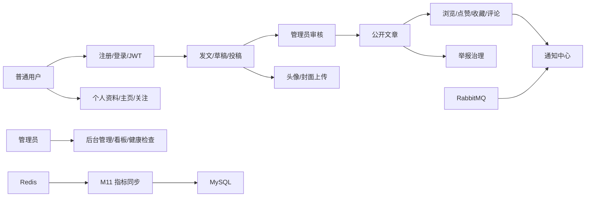

# BitForum 项目链路总览

本文用于后续复习 BitForum 项目的整体业务链路和技术运行链路。阅读时不要只背接口名，要重点理解每条链路从前端页面到后端服务，再到 MySQL、Redis、RabbitMQ 或文件系统的流向。

## 1. 总体链路



一句话理解：项目主线是普通用户生产内容，管理员审核和治理内容，Redis/RabbitMQ 承担高频交互和异步通知，M11/M12 补齐指标持久化和健康检查。

## 2. 认证与权限链路

相关文件：

- 前端页面：`frontend/src/pages/Login.jsx`、`frontend/src/pages/Register.jsx`
- 前端 API：`frontend/src/api/userApi.js`、`frontend/src/api/request.js`
- 后端入口：`UserController`
- 后端服务：`UserService`
- 权限拦截：`LoginInterceptor`、`AdminInterceptor`、`WebMvcConfig`
- 数据表：`user`

链路：

```text
注册 -> POST /api/user/register
     -> UserController.register
     -> UserService.register
     -> BCrypt 加密密码
     -> 写入 user 表

登录 -> POST /api/user/login
     -> UserController.login
     -> UserService.login
     -> 校验密码和用户状态
     -> JwtUtil 生成 JWT
     -> 前端 request.js 保存 token 和用户信息

请求登录态接口 -> request.js 自动携带 Authorization: Bearer token
              -> LoginInterceptor 解析 userId / role / status
              -> Controller 通过 @RequestAttribute 获取当前用户

请求管理员接口 -> /api/admin/**
              -> AdminInterceptor 校验 ADMIN 角色和启用状态
```

学习重点：

- 普通用户权限和管理员权限是两层拦截。
- 前端并不可信，真正的身份判断在后端拦截器。
- 被禁用用户即使 token 还在，也不能继续访问受保护接口。

## 3. 文章生命周期链路

相关文件：

- 前端页面：`PublishArticle.jsx`、`MyArticles.jsx`、`ArticleList.jsx`、`ArticleDetail.jsx`
- 前端 API：`articleApi.js`
- 后端入口：`ArticleController`、`AdminArticleController`、`UserArticleController`
- 后端服务：`ArticleService`
- 数据表：`article`、`article_audit_log`

文章状态：

```text
DRAFT      草稿
PENDING    待审核
PUBLISHED  已发布
REJECTED   已驳回
OFFLINE    已下架
```

用户发文链路：

```text
写文章并保存草稿
-> POST /api/article/draft
-> ArticleService.saveDraft
-> article.status = DRAFT

写文章并提交审核
-> POST /api/article/publish
-> ArticleService.publish
-> article.status = PENDING

草稿或驳回文章再次提交
-> POST /api/article/submit
-> ArticleService.submit
-> article.status = PENDING

作者修改文章
-> PUT /api/article/update
-> ArticleService.update
-> 只允许 DRAFT / REJECTED

作者删除文章
-> DELETE /api/article/delete
-> ArticleService.delete
-> 清理文章和关联 Redis 指标
```

管理员审核链路：

```text
查看待审核文章
-> GET /api/admin/article/audit/page

审核通过
-> PUT /api/admin/article/audit/approve
-> ArticleService.approve
-> article.status = PUBLISHED
-> 写 article_audit_log
-> 写通知
-> 发送 RabbitMQ 文章发布消息

审核驳回
-> PUT /api/admin/article/audit/reject
-> ArticleService.reject
-> article.status = REJECTED
-> 写 article_audit_log
-> 写通知

文章下架
-> PUT /api/admin/article/offline
-> ArticleService.offline
-> article.status = OFFLINE
-> 写 article_audit_log
-> 写通知
-> 清理 Redis 热榜/点赞/浏览量
```

公开阅读规则：

```text
文章列表、搜索、详情、评论、举报、点赞、收藏都只允许围绕 PUBLISHED 文章展开。
```

学习重点：

- `ArticleService` 是整个项目的核心业务服务。
- 文章状态机是内容安全的关键。
- 管理员审核不是简单改状态，还会写审核记录、触发通知和消息队列。

## 4. 板块分类链路

相关文件：

- 前端页面：`PublishArticle.jsx`、后台 `ManageCategories.jsx`
- 前端 API：`categoryApi.js`、`adminApi.js`
- 后端入口：`CategoryController`、`AdminCategoryController`
- 后端服务：`CategoryService`
- 数据表：`category`

链路：

```text
管理员创建板块
-> POST /api/admin/category/create
-> CategoryService.create

管理员修改板块
-> PUT /api/admin/category/update

管理员启用/禁用板块
-> PUT /api/admin/category/enable
-> PUT /api/admin/category/disable

用户发文加载板块
-> GET /api/category/list
-> 只返回启用板块

文章列表按板块筛选
-> GET /api/article/page?categoryId=...
```

学习重点：

- 板块不是纯展示字段，发文时会校验板块是否存在且启用。
- 禁用板块后，新内容不能继续进入该板块。

## 5. 阅读、搜索与热榜链路

相关文件：

- 前端页面：`ArticleList.jsx`、`ArticleDetail.jsx`
- 前端 API：`articleApi.js`
- 后端入口：`ArticleController`
- 后端服务：`ArticleService`、`RedisService`
- 存储：MySQL + Redis

链路：

```text
分页文章列表
-> GET /api/article/page
-> ArticleService.pageArticles
-> MySQL 查询 PUBLISHED 文章

关键词搜索
-> GET /api/article/search
-> ArticleService.searchArticles
-> MySQL LIKE 查询标题/正文

文章详情
-> GET /api/article/detail
-> ArticleService.findPublishedById

浏览一次
-> GET /api/article/view
-> RedisService.incrementView
-> Redis 增加浏览量和热榜分数

热门文章
-> GET /api/article/hot
-> RedisService.getHotList
-> 过滤出仍然 PUBLISHED 的文章
```

学习重点：

- MySQL 保存文章主体。
- Redis 保存高频变化的浏览量、点赞集合和热榜。
- 热榜要过滤文章状态，避免下架文章继续展示。

## 6. 点赞与收藏链路

相关文件：

- 前端页面：`ArticleDetail.jsx`、`MyArticles.jsx`
- 前端 API：`articleApi.js`
- 后端入口：`ArticleController`、`UserFavoriteController`
- 后端服务：`ArticleService`、`RedisService`、`NotificationService`
- 存储：Redis + `article_favorite`

点赞链路：

```text
用户点赞
-> POST /api/article/like
-> 校验文章必须 PUBLISHED
-> 校验不能点赞自己的文章
-> Redis Set 记录 article:{id}:likes
-> 写点赞通知

用户取消点赞
-> POST /api/article/unlike
-> Redis Set 移除当前用户
```

收藏链路：

```text
用户收藏
-> POST /api/article/favorite
-> 校验文章必须 PUBLISHED
-> article_favorite 写入 user_id + article_id
-> 写收藏通知

用户取消收藏
-> DELETE /api/article/favorite
-> 删除 article_favorite 记录

我的收藏
-> GET /api/user/favorites
-> 只展示仍然 PUBLISHED 的文章
```

学习重点：

- 点赞适合 Redis Set，因为需要去重和快速计数。
- 收藏落 MySQL，因为它更像用户长期资产。

## 7. 评论与通知链路

相关文件：

- 前端页面：`ArticleDetail.jsx`、`NotificationCenter.jsx`
- 前端 API：`commentApi.js`、`notificationApi.js`
- 后端入口：`CommentController`、`UserNotificationController`
- 后端服务：`CommentService`、`NotificationService`、`NotificationListener`
- 存储：`comment`、`notification`、Redis、RabbitMQ

评论链路：

```text
发表评论
-> POST /api/comment/publish
-> CommentService.publish
-> 校验文章必须 PUBLISHED
-> 写入 comment 表
-> 如果不是评论自己的文章，写评论通知

查看评论
-> GET /api/comment/listAll?articleId=...
-> 只查看指定文章评论
```

通知链路：

```text
产生通知的场景：
- 评论文章
- 点赞文章
- 收藏文章
- 审核通过
- 审核驳回
- 文章下架

查询通知
-> GET /api/user/notifications

查询未读数
-> GET /api/user/notifications/unread-count

标记单条已读
-> PUT /api/user/notifications/read

全部标记已读
-> PUT /api/user/notifications/read-all
```

RabbitMQ 链路：

```text
管理员审核通过文章
-> ArticleService.approve
-> RabbitTemplate 发送 ArticlePublishMessage
-> RabbitMQ article publish queue
-> NotificationListener 消费消息
-> Redis 判断 messageId 是否已处理
-> 业务处理成功后 ack
-> 消费失败按策略 nack / DLQ
```

学习重点：

- 同步通知由 `NotificationService` 直接写入。
- RabbitMQ 用于演示异步消息链路。
- Redis 在 MQ 消费里承担幂等去重。

## 8. 举报治理链路

相关文件：

- 前端页面：`ArticleDetail.jsx`、`MyArticles.jsx`、后台 `ManageReports.jsx`
- 前端 API：`reportApi.js`、`adminApi.js`
- 后端入口：`UserReportController`、`AdminReportController`
- 后端服务：`ContentReportService`
- 数据表：`content_report`

用户举报链路：

```text
举报文章
-> POST /api/user/reports/article
-> 校验文章存在且 PUBLISHED
-> 校验不能举报自己的文章
-> 校验不能重复提交待处理举报
-> 写 content_report，status = PENDING

举报评论
-> POST /api/user/reports/comment
-> 校验评论所属文章仍然 PUBLISHED
-> 校验不能举报自己的评论
-> 写 content_report

我的举报
-> GET /api/user/reports
```

管理员处理链路：

```text
查看待处理举报
-> GET /api/admin/reports?status=PENDING

确认举报有效
-> PUT /api/admin/reports/resolve
-> status = RESOLVED
-> 写 handler_id / handle_result / handle_time

驳回举报
-> PUT /api/admin/reports/reject
-> status = REJECTED
```

学习重点：

- 举报是治理链路，不是文章状态链路本身。
- V8 增加 pending 举报唯一约束，防止同一用户重复举报同一对象。

## 9. 管理后台链路

相关文件：

- 前端布局：`frontend/src/layouts/AdminLayout.jsx`
- 前端页面：`frontend/src/pages/admin/*`
- 前端 API：`adminApi.js`
- 后端入口：所有 `/api/admin/**`
- 权限：`AdminInterceptor`

后台功能：

```text
后台首页看板
-> Dashboard.jsx
-> GET /api/admin/dashboard/summary
-> AdminDashboardService 汇总用户、文章、评论、通知、举报、Redis 热榜

文章审核
-> AuditArticles.jsx
-> /api/admin/article/audit/page
-> /api/admin/article/audit/approve
-> /api/admin/article/audit/reject

文章管理
-> ManageArticles.jsx
-> /api/admin/article/page
-> /api/admin/article/offline
-> /api/admin/article/delete

评论管理
-> ManageComments.jsx
-> /api/admin/comment/page
-> /api/admin/comment/delete

用户管理
-> ManageUsers.jsx
-> /api/admin/user/page
-> /api/admin/user/disable
-> /api/admin/user/enable

板块管理
-> ManageCategories.jsx
-> /api/admin/category/*

举报管理
-> ManageReports.jsx
-> /api/admin/reports

健康检查
-> /api/admin/health
```

学习重点：

- 后台不是一个 Controller，而是一组按资源拆分的管理 Controller。
- `/api/admin/**` 是后台权限边界。

## 10. 用户主页与关注链路

相关文件：

- 前端页面：`MyArticles.jsx`、`PublicUserProfile.jsx`、`ArticleDetail.jsx`
- 前端 API：`userApi.js`
- 后端入口：`UserProfileController`、`UserFollowController`
- 后端服务：`UserService`、`UserFollowService`
- 数据表：`user`、`user_follow`

个人资料链路：

```text
查看我的资料
-> GET /api/user/profile
-> UserService.getCurrentProfile
-> 返回 avatar / nickname / bio / 文章数 / 收藏数

修改我的资料
-> PUT /api/user/profile
-> UserService.updateProfile
-> 更新 avatar / nickname / bio

查看公开主页
-> GET /api/users/{userId}/profile
-> 返回公开资料、文章数、收藏数、关注数、粉丝数、当前用户是否已关注

查看用户公开文章
-> GET /api/users/{userId}/articles
-> 只返回 PUBLISHED 文章
```

关注链路：

```text
关注用户
-> POST /api/users/{userId}/follow
-> UserFollowService.follow
-> 禁止关注自己
-> 禁止重复关注
-> 写 user_follow

取消关注
-> DELETE /api/users/{userId}/follow
-> 删除 user_follow

查看粉丝
-> GET /api/users/{userId}/followers

查看关注列表
-> GET /api/users/{userId}/following

查看关注统计
-> GET /api/users/{userId}/follow-stats
```

学习重点：

- M7/M9 把项目从内容社区扩展成用户关系社区。
- 公开主页接口支持未登录访问，但会在有 token 时额外返回当前用户是否已关注。

## 11. 文件上传链路

相关文件：

- 前端 API：`uploadApi.js`
- 前端页面：`PublishArticle.jsx`、`MyArticles.jsx`
- 后端入口：`FileUploadController`
- 后端服务：`FileUploadService`
- 静态资源：`WebMvcConfig`
- 本地目录：`uploads/`

链路：

```text
上传头像
-> POST /api/upload/avatar
-> multipart/form-data
-> FileUploadService.uploadAvatar
-> 校验图片类型和大小
-> 保存到 uploads/avatar
-> 返回 /uploads/avatar/{filename}
-> 前端保存到 user.avatar

上传文章封面
-> POST /api/upload/article-cover
-> FileUploadService.uploadArticleCover
-> 保存到 uploads/article-cover
-> 返回 /uploads/article-cover/{filename}
-> 前端保存到 article.coverUrl

访问上传文件
-> GET /uploads/**
-> WebMvcConfig 静态资源映射
```

限制：

```text
头像最大 2MB
文章封面最大 5MB
只允许 image/jpeg、image/png、image/webp
uploads/ 已加入 .gitignore
```

学习重点：

- 文件本身不进数据库，数据库只保存 URL。
- 本地文件上传适合毕业设计演示，真实生产环境通常会换对象存储。

## 12. Redis 与指标同步链路

相关文件：

- Redis 服务：`RedisService`
- 同步任务：`ArticleMetricSyncJob`
- 同步服务：`ArticleMetricSyncService`
- 启动类：`BitForumSpringApplication`
- 存储：Redis + MySQL `article`

Redis 当前职责：

```text
文章浏览量
文章点赞集合
文章热榜 ZSet
RabbitMQ 消息幂等 ID
```

M11 指标同步链路：

```text
Spring 定时任务启动
-> ArticleMetricSyncJob.syncArticleMetrics
-> ArticleMetricSyncService.syncArticleMetrics
-> 查询 MySQL 中 PUBLISHED 文章
-> RedisService.getViewsIfPresent
-> RedisService.getLikeCountIfPresent
-> 若 Redis key 存在且数值变化，则更新 MySQL article
-> 若 Redis key 不存在，则跳过，避免把 MySQL 指标覆盖成 0
```

学习重点：

- Redis 负责高频写，MySQL 负责最终持久化。
- 同步只处理 `PUBLISHED` 文章，避免草稿/下架文章进入公开指标链路。
- 缓存 key 不存在时不覆盖数据库，这是防止数据回退的保护。

## 13. 健康检查与 OpenAPI 链路

相关文件：

- OpenAPI：`OpenApiConfig`、Controller 上的 `@Tag` / `@Operation`
- 健康检查入口：`AdminHealthController`
- 健康检查服务：`AdminHealthService`
- 配置：`application.yml`

OpenAPI 链路：

```text
访问 Swagger UI
-> /swagger-ui/index.html

获取接口 JSON
-> /v3/api-docs

Controller 注解
-> @Tag
-> @Operation
-> @SecurityRequirement
```

健康检查链路：

```text
公开健康检查
-> GET /actuator/health
-> 不暴露详细组件信息

管理员健康检查
-> GET /api/admin/health
-> AdminHealthService.check
-> 检查应用服务
-> 检查 MySQL SELECT 1
-> 检查 Redis PING
-> 检查 RabbitMQ connection
-> 汇总 UP / DOWN
```

学习重点：

- M8 是接口文档链路，方便调试和答辩展示。
- M12 是可观察性链路，说明项目能检查依赖服务状态。

## 14. 数据库演进链路

Flyway 迁移：

```text
V1  初始化 user / article / comment
V2  增加用户 role / status
V3  增加 category 板块
V4  增加文章审核状态与审核记录
V5  增加 article_favorite 收藏
V6  增加 notification 通知
V7  增加 content_report 举报
V8  增加待处理举报唯一约束
V9  增加用户资料字段 avatar / nickname / bio
V10 增加 user_follow 关注关系
V11 增加文章封面等上传相关字段
```

学习重点：

- Flyway 让数据库结构变化可追踪、可复现。
- 每个模块基本都有对应迁移或依赖已有迁移。
- 看项目演进时，可以用迁移版本反推模块顺序。

## 15. 前端整体链路

前端没有使用 React Router，而是由 `App.jsx` 维护页面状态：

```text
activePage
selectedArticleId
selectedUserId
adminTab
currentUser
```

主要页面：

```text
Login.jsx / Register.jsx
-> 登录注册

ArticleList.jsx
-> 文章列表、搜索、热门文章

ArticleDetail.jsx
-> 详情、浏览、评论、点赞、收藏、举报、查看作者主页

PublishArticle.jsx
-> 发布文章、保存草稿、上传封面

MyArticles.jsx
-> 个人资料、我的文章、我的收藏、我的举报、头像/封面维护

PublicUserProfile.jsx
-> 公开主页、公开文章、关注/取消关注、粉丝/关注列表

NotificationCenter.jsx
-> 通知列表、未读数、标记已读

admin/*
-> 后台看板、审核、文章、评论、用户、板块、举报、健康检查
```

请求统一经过 `request.js`：

```text
设置 baseURL = /api
请求前附加 JWT
响应后统一取 body.data
统一处理后端错误
统一处理网络错误和上传错误
```

## 16. 后端分层链路

后端典型调用关系：

```text
Controller
-> 接收 HTTP 参数 / JSON / Multipart
-> 做当前用户身份读取
-> 调用 Service

Service
-> 核心业务规则
-> 状态判断
-> 事务控制
-> 调用 Mapper / Redis / RabbitMQ / 文件系统

Mapper
-> MyBatis-Plus CRUD
-> 自定义分页查询

Entity
-> 数据表字段映射

DTO
-> 请求/响应对象
-> 避免直接暴露敏感字段
```

典型例子：

```text
ArticleController.publish
-> ArticleService.publish
-> CategoryService.findEnabledById
-> ArticleMapper.insert
-> 返回 Result
```

## 17. 推荐学习顺序

按下面顺序读代码，理解会更顺：

```text
1. UserController / UserService / LoginInterceptor / AdminInterceptor
2. ArticleController / ArticleService / 文章状态流转
3. AdminArticleController / 审核链路
4. CategoryController / CategoryService
5. RedisService / 浏览量 / 点赞 / 热榜
6. CommentService / NotificationService
7. RabbitMQConfig / NotificationListener
8. ContentReportService / 举报治理
9. AdminDashboardService / 后台统计
10. UserProfileController / UserFollowController
11. FileUploadController / FileUploadService
12. ArticleMetricSyncJob / ArticleMetricSyncService
13. AdminHealthController / AdminHealthService
14. frontend/src/api/*
15. frontend/src/pages/*
```

## 18. 答辩表达模板

可以按这段话讲项目：

```text
BitForum 是一个前后端分离的社区论坛系统。普通用户可以注册登录、发布文章、保存草稿、提交审核、浏览文章、评论、点赞、收藏、举报内容，也可以维护个人主页并关注其他用户。管理员通过后台完成文章审核、内容下架、用户管理、板块管理、举报处理和数据看板查看。技术上，后端使用 Spring Boot、MyBatis-Plus、MySQL 和 Flyway 管理核心业务数据；Redis 承担浏览量、点赞集合、热榜和消息幂等；RabbitMQ 用于文章发布后的异步消息处理；前端使用 React 和 Vite 实现页面交互。后续模块中还补充了 OpenAPI 文档、文件上传、Redis 指标定时落库和 Actuator 健康检查，使项目从业务功能扩展到工程化交付闭环。
```
